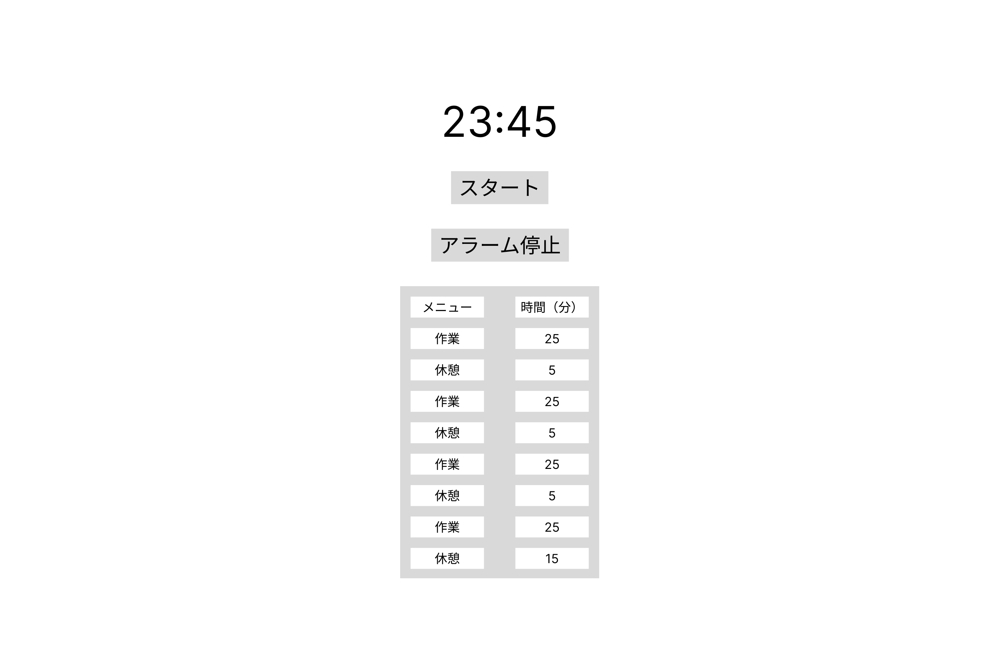

# ポモドーロアプリの仕様

## 2023-03-21

ひとまず単純なポモドーロタイマーだけ欲しい。
基本的なポモドーロの作業と休憩の時間構成で順番にタイマーをセットしてアラームを鳴らせれば十分。

### タイマー構成

| メニュー | 時間 (min) |
|:-----|:--------:|
| 作業   |    25    |
| 短い休憩 |    5     |
| 作業   |    25    |
| 短い休憩 |    5     |
| 作業   |    25    |
| 短い休憩 |    5     |
| 作業   |    25    |
| 長い休憩 |    15    |
| 合計   |   120    |

### 画面要素

- タイマー残り時間
- タイマースタート／ストップボタン
- アラーム停止ボタン
- タイマー表

### ユースケース

- スタートボタンを押してタイマーを開始する
- ストップボタンを押してタイマーを停止する
- アラーム停止ボタンを押してアラームを停止する

### イベント

- スタートボタンが押されたら、タイマーが開始される
- ストップボタンが押されたら、タイマーが一時停止される
- タイマーが開始されたら、スタートボタンがストップボタンに変化する
- タイマーが一時停止されたら、ストップボタンがスタートボタンに変化する
- タイマーの経過に応じて、残り時間が変化する
- タイマーが終了したら、アラームが開始される
- タイマーが終了したら、次のタイマーが開始する
- 最後のタイマーが終了したら、最初のタイマーが開始する
- アラームが開始されたら、アラーム停止ボタンが有効化される
- アラームが開始されたら、タイマー表の起動中タイマーの行がハイライトされる
- アラーム停止ボタンが押されたら、アラームが停止される
- アラームが停止されたら、アラーム停止ボタンが無効化される
- アラームが停止されたら、タイマー表の起動中タイマーの行のハイライトが解除される
- アラームが停止されないまま10秒経過したら、アラームが停止される
